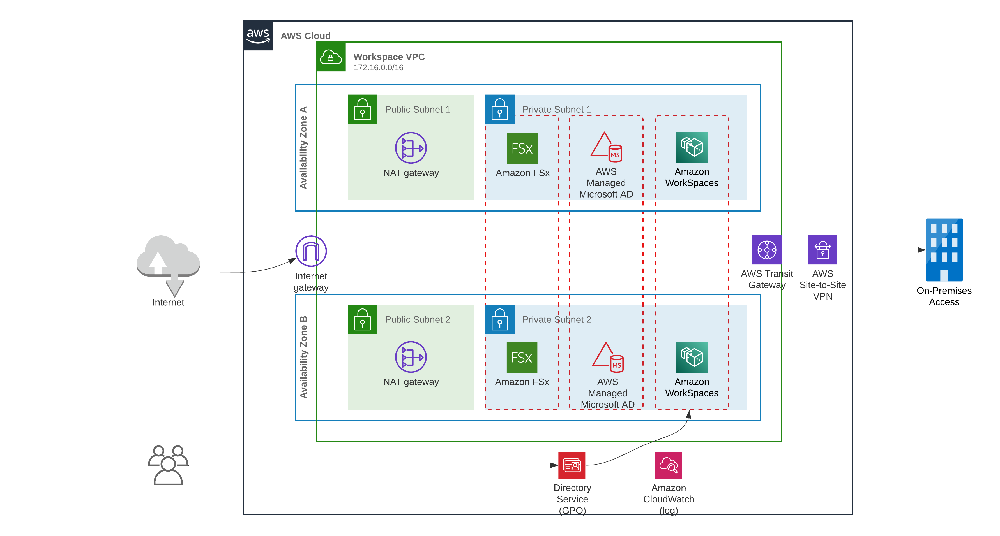
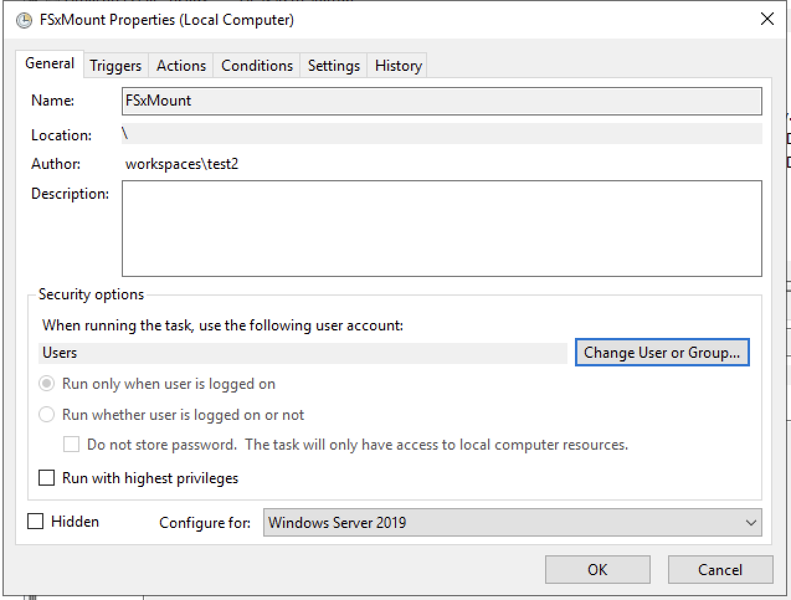
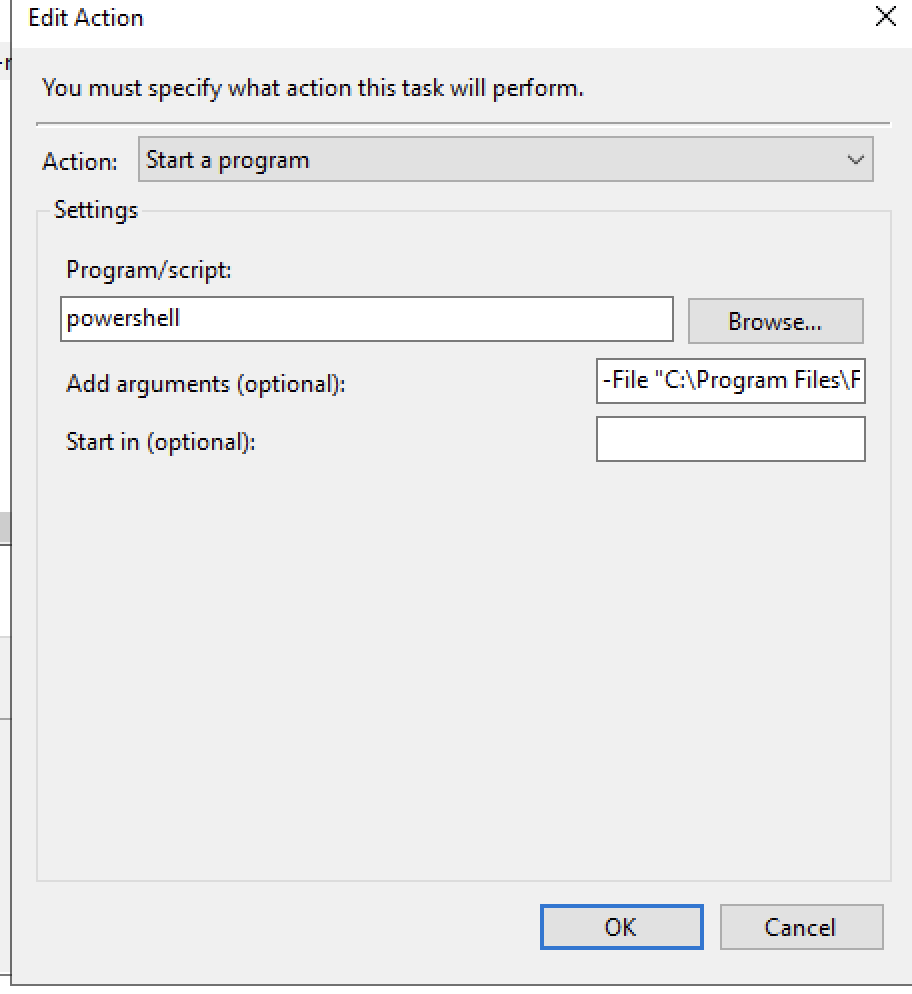
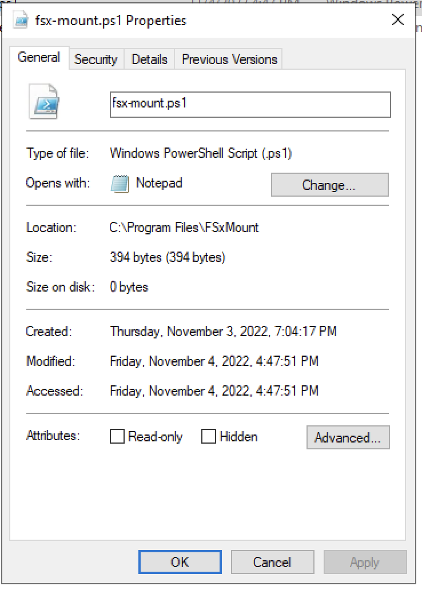
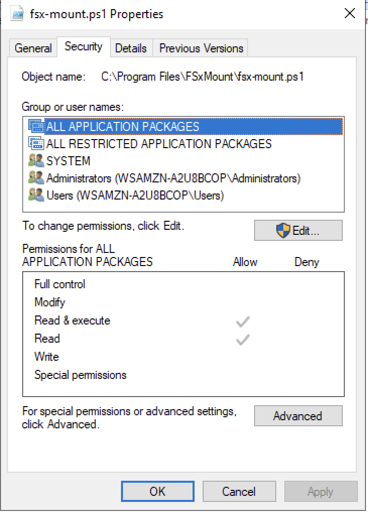
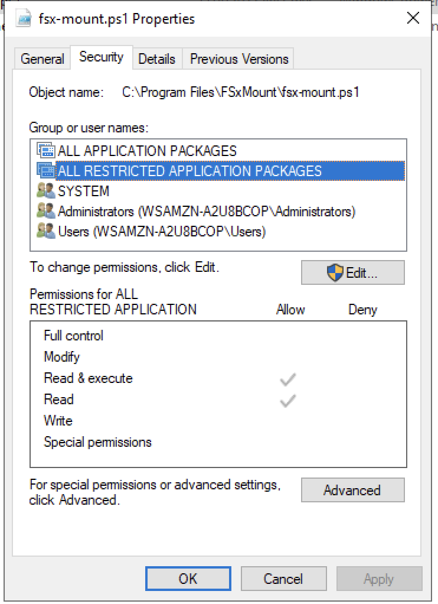
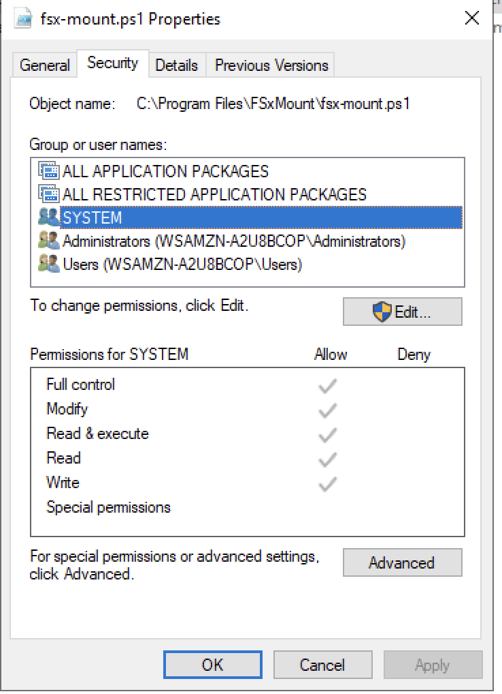
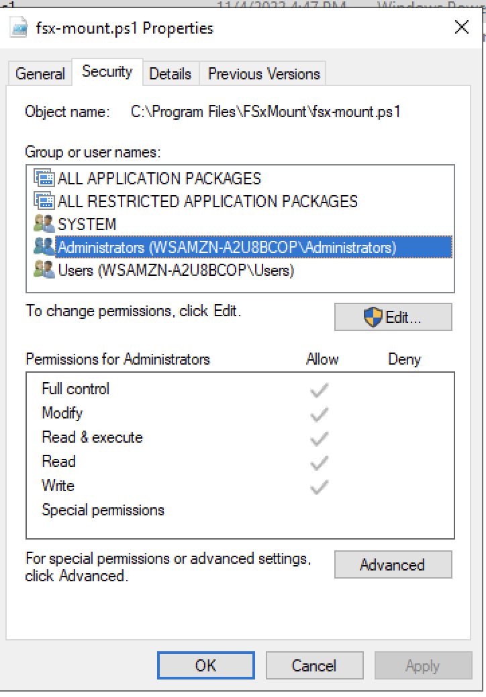
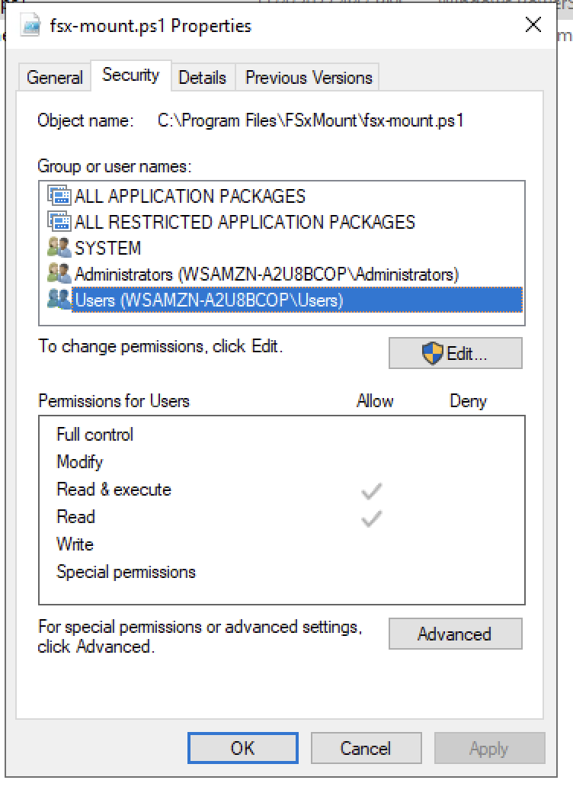
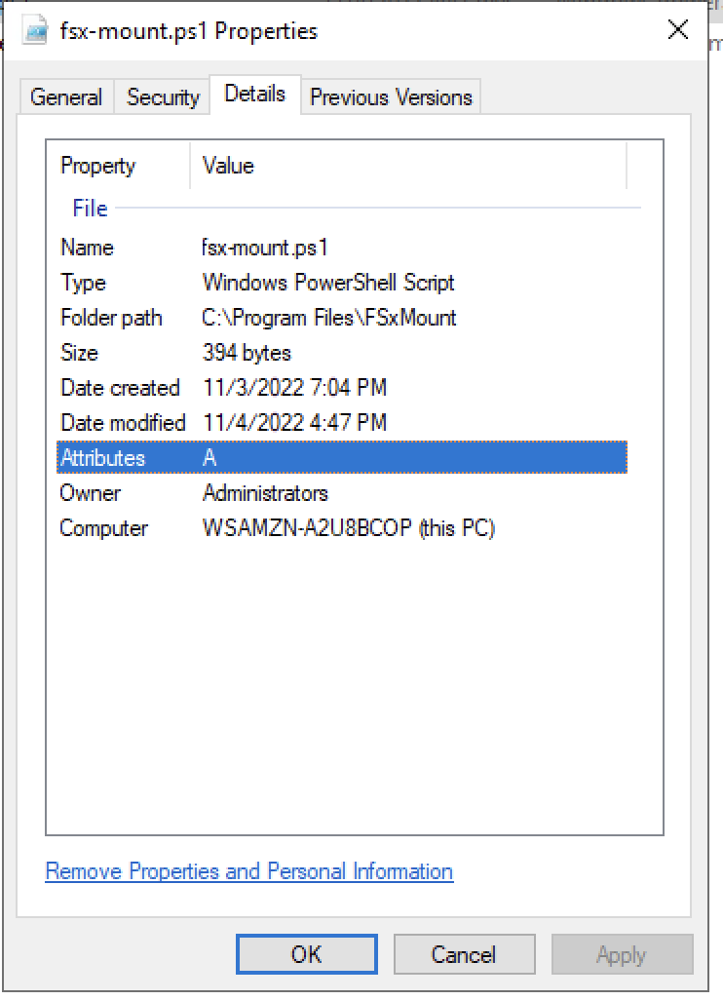

# AWS Workspace - Cevo Pattern Library

The below pattern can be used to create AWS Workspace and any combination of other components based on parameters.

1. AWS Workspace ( Deployed on separate VPC with Managed AD)
2. Unrestricted / Restricted internet access to Workspace users.
3. A FsX Windows file share
4. A VPN Connection to On-premise (via Transit Gateway)
5. Tags for cost calculation.

## Authors

- [@Gokulanth-Venugopal](https://github.com/Gokulnath-Venugopal)


## Architecture



## Deployment

To deploy this project run

```bash
  make test
  make deploy
```
Important note: For deployment, create the VPC and the Active Directory first (Comment the workspace-related code, the last section that gets constant updates). Then register the ActiveDirectory in Workspace, create users and then uncomment the workspace part of the code to deploy workspace. (The registering of the active-directory cannot be done using CFN and creating a workspace without this step will cause errors)

## Documentation

The template by default created a VPC for workspace deployment, a managed AWS Active Directory and AWS Workspace.

* Choose a boolean value for "WindowsFileShare" to create a Windows FsX file share. The values for the variables "StorageCapacity" & "ThroughputCapacity" takes effect only if "WindowsFileShare" is set to "true".
    
    #Note: If FsX is used, then a custom script has to be added to the workspace (as part of the workspace image), to mount the FsX on user logon to the workspace. Detailed documentation is provided in the second part of the document.
        
        Example:    WindowsFileShare: "false"
                    StorageCapacity: "100"
                    ThroughputCapacity: "32" 

* Choose a boolean value for "VPNConnection" to create a VPN connection between Workspace VPC to On-premise VPC and corresponding routes via transit gateway. The values for the variables "OnPremiseVPNTerminationIP" & "OnPremiseCIDR" takes effect only if "VPNConnection" is set to "true". 
* Setting true to VPN creates a site-to-site VPN connection, customer gateway for VPN termination in VPC, transit gateway, transit gateway attachments and route tables, and route entries in the private subnet route table.
        
        Example :   VPNConnection: "true"
                    OnPremiseVPNTerminationIP: "1.1.1.1"
                    OnPremiseCIDR: "172.16.0.0/16"


* Choose a boolean value for "UnlimitedInternetAccesstoWorkspace" to update the route-table and to provide unlimited internet access from the workspace.

        Example :   UnlimitedInternetAccesstoWorkspace: "true"


* Choose a boolean value for "UnlimitedInternetAccesstoWorkspace" to update the route table and to provide limited or no internet access from the workspace. 2 custom IP addresses can be provided for limited outbound access. Kindly update the template for more custom outbound connections.

        Example :   RestrictedInternetAccesstoWorkspace: "true"
                    CustomIPAddress1: "1.2.3.4/32"
                    CustomIPAddress2: "1.3.4.5/32"

* Use the below values to add tags to the AWS resources.

        Example :   BusinessGroup: "Cevo"
                    CostCenter: "LibraryPattern"


FsXMount Script : 

1. Create a scipt "Fsx-mount.ps1" under "C:\ProgramFiles\FsXMount".
        
        script : 
                    Write-Host "Hello! The below script mounts the FSx File system to Windows server"
                    New-PSDrive –Name “Z” –PSProvider FileSystem –Root “\\amznfsxdaaaaaaa.cevo.pattern-library.com\share” –Persist

2. Open Task Scheduler and follow the below steps to create a task to mount FsX on user logon. Create a bundled image after completion of all below steps and use the bundle-id for auto FsX logon for all new users created.

        Commands in the task scheduler : 
                powershell
                -File "C:\Program Files\FSxMount\fsx-mount.ps1"





3. Validate the file permission of the fsx-mount.ps1 script.









